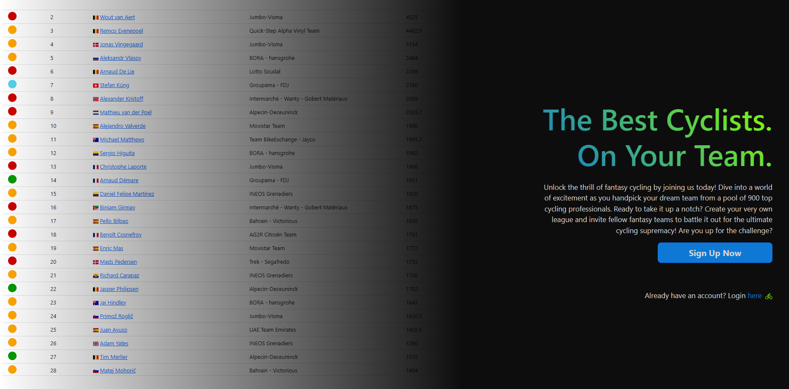
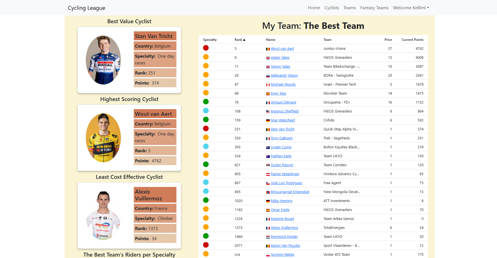

# Create a Fantasy Cycling Team

### render deploy: https://fantasy-cycling.onrender.com

### About

You need to register or login to get the full site functionality, feel free to use fake Steve and adjust his team/league:

email: steve@email.com
pass: secret

I also didn't put any significant checks on the email, so you can just throw in a fake email if you want to see the site as a blank slate.

This is a MERN stack project I created where users can ultimately view individual information about the top 900 UCI pros, see all of the riders on professional teams, and where users can create their own fantasy teams and league. To create a team, a user must register and be logged in, and to create a league a registered user must have a fantasy team. Once a user has created a fantasy team, they have access to a dashboard screen where they can view their entire team, as well as a variety of statistics about their team (for example, you can see the highest scoring rider, the least cost effective rider, how many cyclists you have in each discipline (sprint, one day, time trial, climbers), best value cyclist). The data for each cyclist is scraped with Puppeteer from a cycling site, and I used that data to seed my DB.

### Limitations of the Site

Users can only have ONE fantasy team and ONE fantasy league, which is not a limitation. However, I've implemented this on the backend but not the frontend. If you go to create a new team after already saving one, it will delete any previous teams/leagues held by the user. But I kept it this way for now in case you wanted to keep playing with creating teams/leagues. I stored fantasy teams and leagues on the user model, so it would just be a quick check and some conditional rendering to restrict this interaction on the frontend.

I wanted to create this site because there aren't really a lot of fantasy cycling sites out there, and the one we currently use could have more interesting data and user-friendly UI. However, my project unfortunately has a major limitation in that I had to scrape my data to seed my DB...thus, for starters I couldn't get all the data I wanted, and the data only updates when I force it (because I don't want to have a button to run the scrape function - I don't want to scrape an external site too often - plus the scrape update takes quite a long time!).

I also don't have the point scoring functionality that I'd like; I would ideally like to display a list of races where the top 5 or 10 or 20 riders score points...then, I would update the DB and use those points as each cyclists "current points", which is what would dictate the total of each users totalPoints for their fantasy team. However, I would have to essentially scrape and seed another collection with this information, and I'd have the same issues with not wanting to update this data too often. In the future, this could be something to add, but overall it's unlikely since the site still won't perform the way I want. Ideally, I would create and maintain my own database with all 3000 cyclists and how ever many hundreds of races and results...but alas, that would take up my entire life.

### Languages / Tools / Technologies

#### Backend:

Node, Express, MongoDB, Mongoose, Bcrypt, Cookie-Parser, Http Status Codes, Json Web Token, Puppeteer

#### Frontend:

JavaScript, React, TypeScript, Redux Toolkit, Bootstrap, React Router, React Data Table, React Country Flag, React Icons, Recharts

### Project Highlights

1. Significant use of Puppeteer to scrape data in order to seed DB.
2. Use of many MongoDB methods for CRUD functionality, also aggregations to create a teams collection. Several Schemas and refs between Schemas to better store and access data
3. Backend generates JSON web token for the frontend, and some of that information is put in local storage.
4. Backend pagination, sorting, and filtering. This is hooked up to a search bar and filtering tabs in the frontend so users can sort cyclists by their specialty, or they can search for a specific name.
5. RTK to make calls to the backend and manage some frontend state.
6. Conditional rendering of pages, features, and other UI based on route paths and/or presence of a logged-in user.
7. Quite a bit of bootstrap, plus the page is generally responsive to many screen sizes.
8. Several helper functions that filter through team data to show the user various stats about their team. There is also a function that allows a user to see any "shared riders"; for example, if Wout Van Aert is on a users fantasy team, they will see "On my Team" when they see Wout's information on another user's team, or if they are on the Jumbo Visma team page.
9. Several tables from Recharts, complete with custom colors and legends...which probably took too much time to figure out.
10. Displays loading and error states from the backend

### Challenges / What to Continue

I really liked working in the MERN stack - being able to build an entire site was actually really helpful in getting me to organize my thoughts, plan, and work on the site in a more methodical manner.

As mentioned above, I found very quickly that scraping limited what data I could and couldn't get so the site doesn't function quite how I would want it to, particulary in terms of point scoring. I've also seen there are a few female riders mixed in with the male riders...not very many, weirdly, but it's definitely an issue with the data. I'd ideally like to have a mens and womens version, but scraping wouldn't allow for that.

I learned that RTK and TypeScript aren't my favorite things to use together, though the documentation was helpful. Perhaps I shouldn't admit it, but documentation can still be difficult for me sometimes so I was pleased that the RTK with TS was a bit easier for me to grasp. Declaring and working with some of the initial state with Redux and TS also took me quite awhile in some instances, especially with the user object. It took me quite awhile to figure out that, based on how I'd set up initial state, I had to typecheck whether the user object was a string or an object.

I also started implementing the same component for different routes, but then using route paths as a way to determine small changes as to what was being shown in the UI. At first, I thought this was the best thing ever because it cut down on my code. However, I eventually started to wonder if it's worth it, because I had to include logic to figure out what to render (I mean, 90% of it was the same, the small changes were usually titles or booleans to be passed down to children)...overall, that sometimes made the component a little difficult to understand, especially if I hadn't worked on it in a week or two. So, I do have another screen (cyclistscreen) that I think could be combined with some of my teams list screens, but I decided not to because I didn't want the shared component to get too bloated. Their purpose was also slightly different, as one showed a single rider but the other showed riders grouped by their respective teams.

Bootstrap...I'm undecided how I feel about it. I tried to implement Bootstrap for the vast majority of my code, relying a lot on their Col and Row components. Of course, it made things like Navbars and Accordions extremely quick and simple, but I'm not sure I got the hang of the Rows and Cols - I like to use flexbox, so I kept trying to implement flexbox when I think I should have spent more time better arranging my Rows and Cols. It ended up getting quite confusing, actually, as I'd make a change and the UI would sometimes change in a very unexpected way.

I mean, it could definitely use some more styling...it's not the most jazzy thing, but the styling became less of a focus as I started to get a better grasp on the fact that this project turned out to be bigger than I anticipated.

## Get Started

Clone the code as usual, but in your server.js file, you need to import and run seedDataBase (from utils > scraping.js). I also have a scraper that will scrape year end rank because I forgot to do that the first time - I added it to the initial seedDataBase function, but just keep in mind if you don't see it you can run the updateYearEndRank.

Similarly, to update points and rank for each rider (which effectively updates the total score for a user's fantasy team), import and run updatePointsAndRank (from utils > scraping.js) in your server.js
